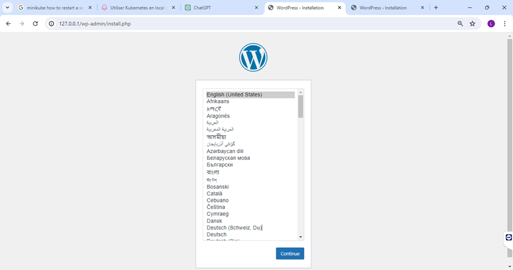

# Ce projet déploit 
•	Pour une Agence web: 1 application Stateful avec trois réplicas
o	WordPress
o	bases de données mysql

=> Une foirs les déploiements terminés un service ingress 'wordpress-ingress' sera lancé pour accéder à l'interface wordpress

Note: l'environnement de déploiement était windows d'où l’@IP du service mysql renseigné dans le wordpress-deployment au lieu du nom du service. 

# Lier le repository docker minikube à son terminal
minikube -p minikube docker-env | Invoke-Expression

# Créer le déploiement et le service mysql
kubectl apply -f .\mysql-service.yaml
kubectl apply -f .\mysql-deployment.yaml
kubectl apply -f .\mysql-pvc.yaml

# Créer le déploiement et le service wordpress
kubectl apply -f .\wordpress-service.yaml
kubectl apply -f .\wordpress-deployment.yaml
kubectl apply -f .\wordpress-pvc.yaml

# Deploy wordpress-ingress.yaml et Activer le ingress controller 
kubectl apply -f .\wordpress-ingress.yaml

minikube addons enable ingress

# Afficher les iongress
kubectl get ingress
# NAME              CLASS   HOSTS                     ADDRESS        PORTS   AGE
nginx-ingress       nginx   site1.local,site2.local   192.168.49.2   80      5d11h
wordpress-ingress   nginx   site.wordpress            192.168.49.2   80      73s

# Modifier le fichier hosts avec l’@IP de la machine et nom du host
# <IP_Minikube> <nom_host>
# Pour Ingress de wordpress-mysql, le site sera accessible via cette configuration
127.0.0.1 site.wordpress

# Lancer la commande suivante sur un terminale pour mettre l'ingress à disposition et donner l'accès au site wordpress (service wordpress) dans un navigateur
minikube tunnel

# Voici le site
Vérifier sur un navigateur
http://localhost/site.wordpress

 